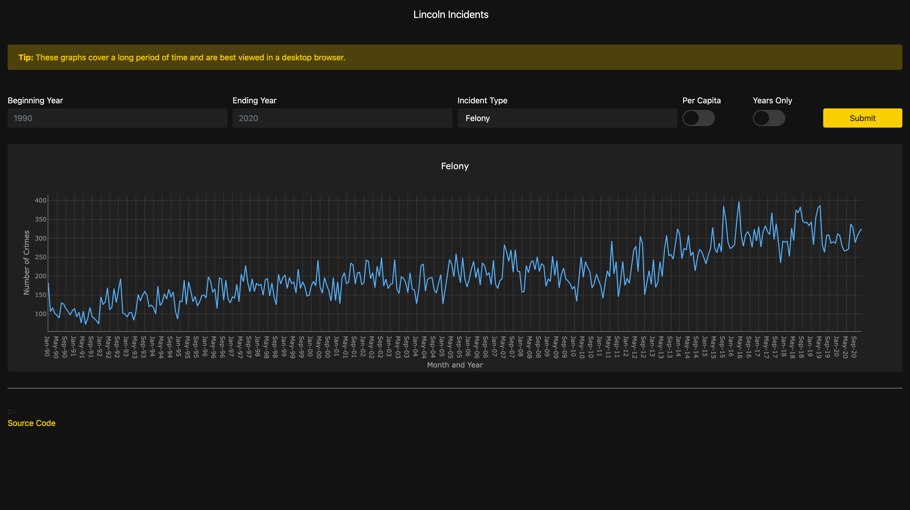

# Lincoln Incidents

This dashboard uses a Plotly.js chart to display crime data for Lincoln,
Nebraska from January 1990 through today. All data was extracted from the
[Lincoln Police website](https://www.lincoln.ne.gov/city/police/activityindex.htm)
and can be found in Excel format in the `data` folder. Population estimates for
per capita calculations were extracted from the
[Lincoln City website](https://lincoln.ne.gov/city/plan/reports/reports/popest.pdf)
and can be found in PDF format in the `data` folder.

## Preview

